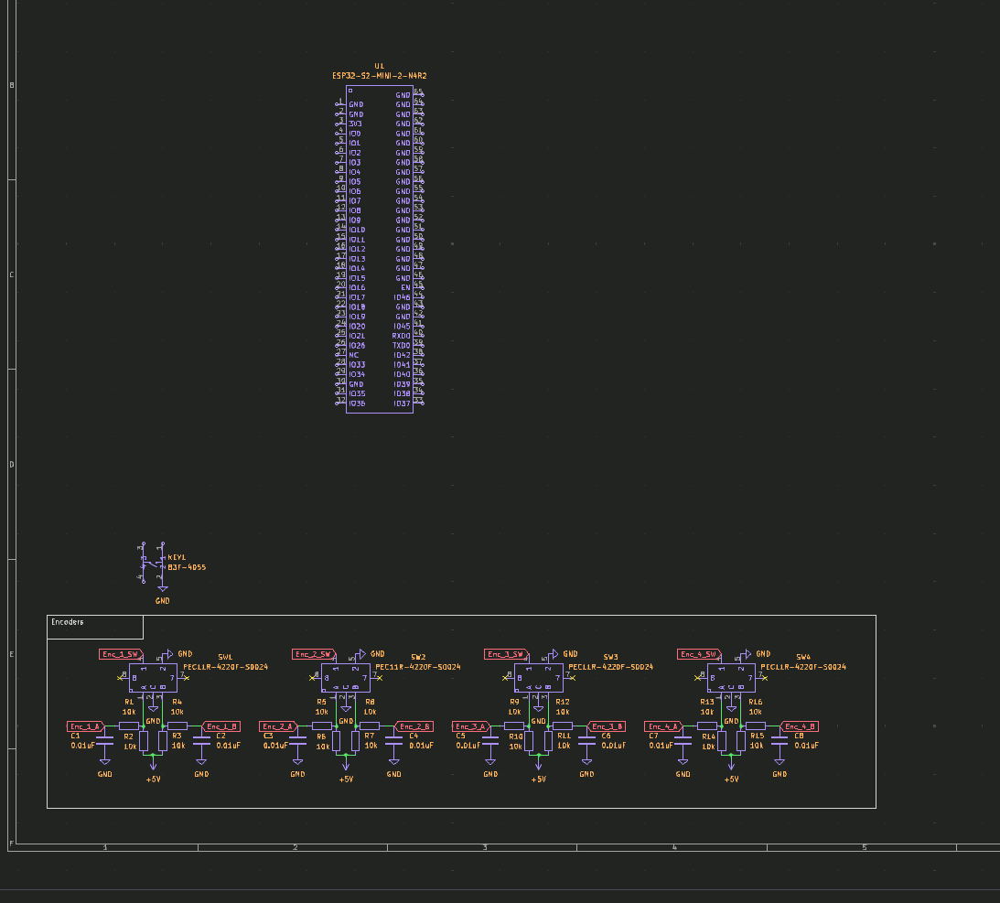
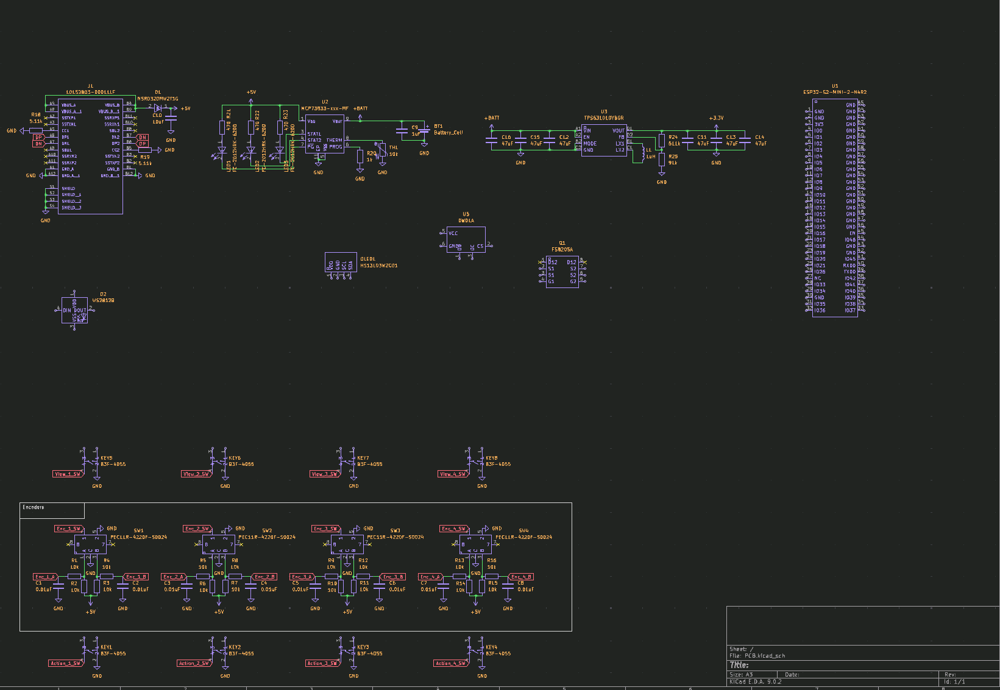
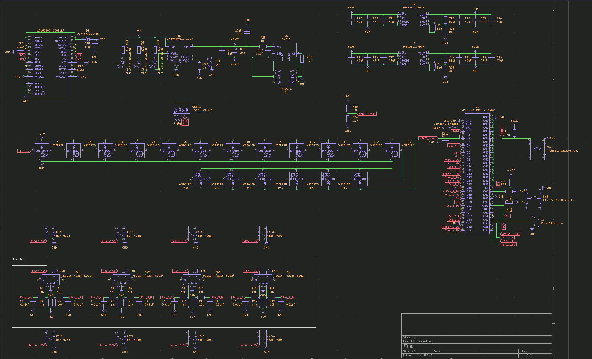
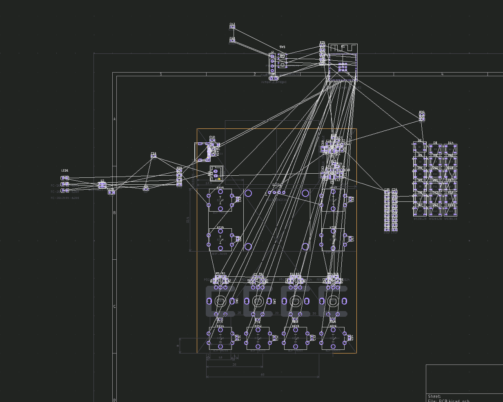
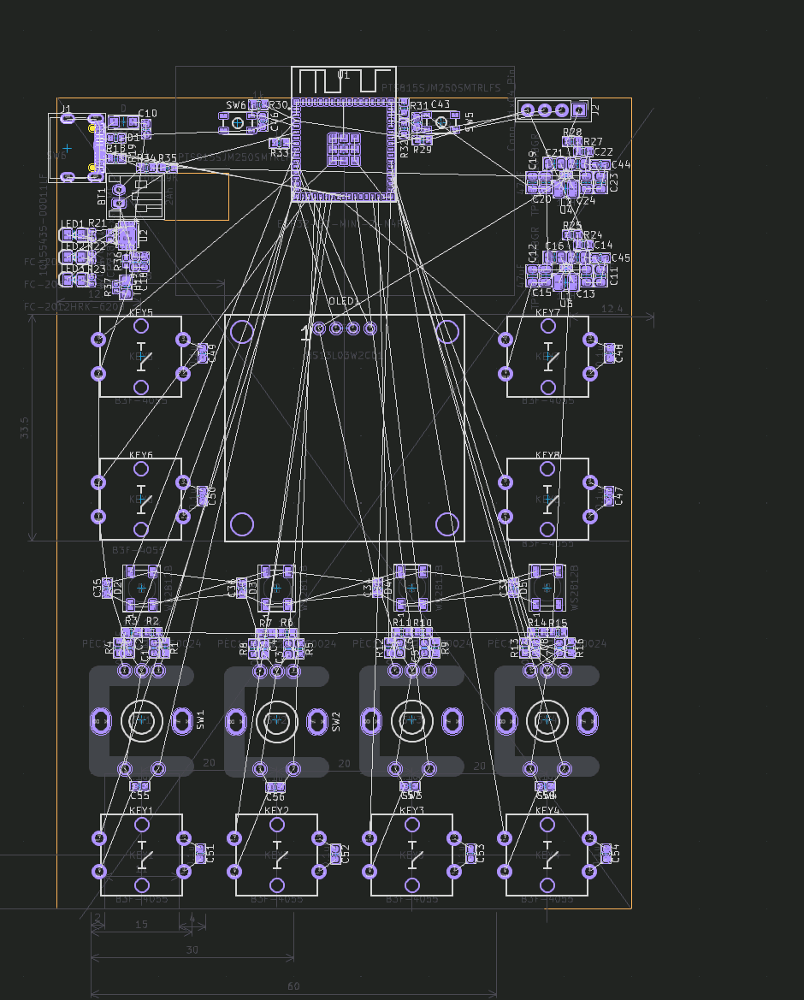
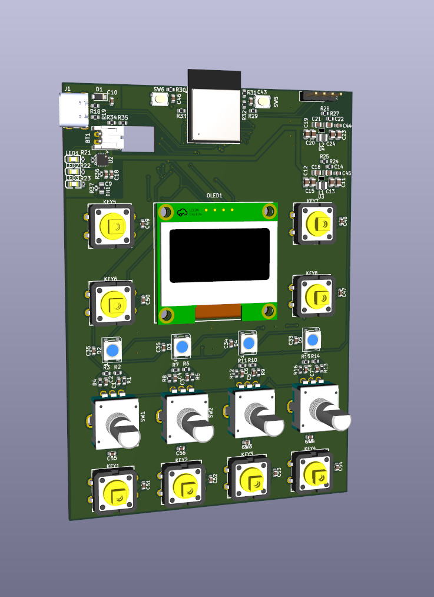
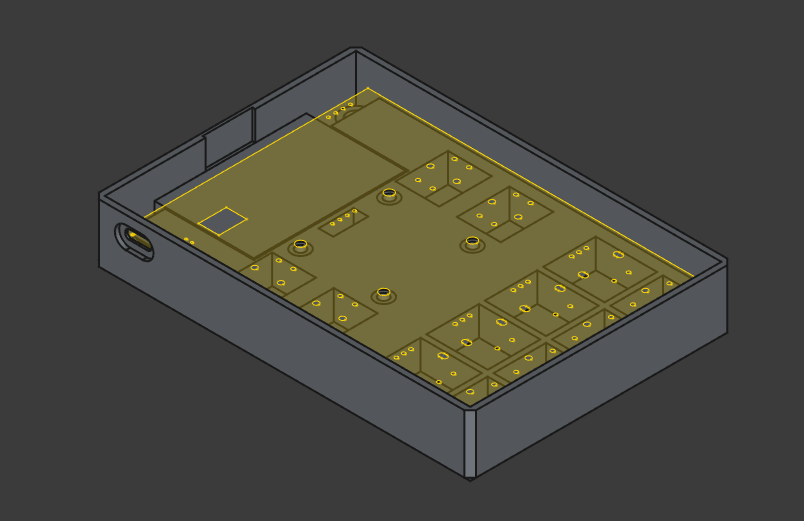
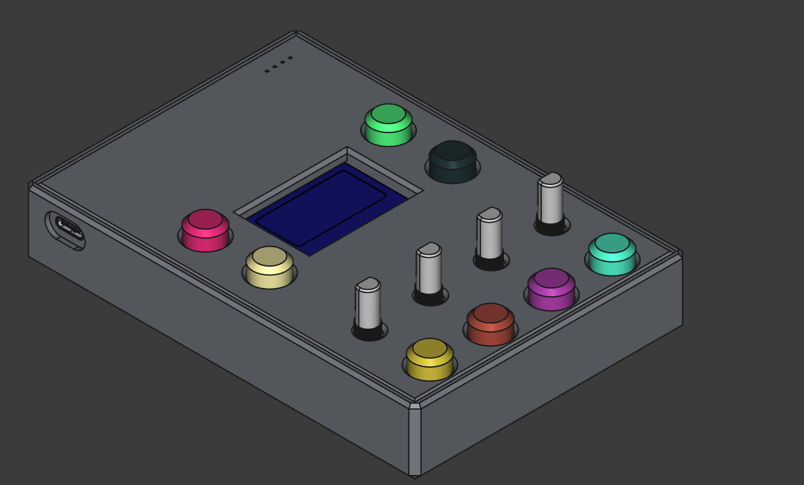

# May 18th: Sketch and first prototype!
To start, I did a simple sketch of what I would like for the Pad to be, and what features it should have. I wanted to keep it simple, so I focused on the most important features that would make it useful for controlling Home Assistant devices.

Features I ended up with:

1* Mode/View toggle buttons

2* Adjustment knobs (pots or encoders)

3* Action buttons

4* Toggle switches (Not used)

5* USB-C Charge port

6* display info (OLED)

I also tested how to drive an I2C dispay with the an ESP32-C3 and use multiple Screens activated with buttons.
Used this as reference: [SSD1306](https://esphome.io/components/display/ssd1306)

**Total time spent: 3h**

# May 19th: Using potentiometers and dynamically updating the display
I wanted to use potentiometers to adjust values, so I started testing how to read them with the ESP32-C3. I found that using the ADC pins wasn't as easy as I thought, as I had to set `attenuation: 12db` to allow 0~3.3V range.

PS: The potentiometer later broke and replaced it with a smaller one

**Total time spent: 4h**

# May 20th: Adding action buttons and indicator bar.
Next I wanted to add action buttons so I could trigger or toggle items in Home Assistant. To test, I used it to turn on and off a light.

I also added coded an indicator bar to show the current value of the device.

PS: While coding the bar, I found a bug (may also be user error) but it seems like if use the same variable twice for the same screen item(eg. rectangle). The esp32 refuses to connect to wifi, it also doesn't respond to actions (eg. button presses)

**Total time spent: 3h**

# May 21st: Find limitations of ESP32-C3
I started wiring the remaining action buttons and potentiometers, when I realised that the ESP32-C3 has a limitation of 11 GPIO pins. 3 of which are ADC. This means I'm unable to use all the buttons, potentiometers and the OLED display at the same time. So when designing the PCB I'll have to switch to the ESP32-S2.

**Total time spent: 2h**

# May 22nd: Start designing the Schematic
I started designing the schematic for the PCB, using the ESP32-S2. I used the ESP32-S2-MINI-2-N4R2, PEC11R-4220F-S0024 (rotary encoders) and B3F-4055 (tactile switches).

**Total time spent: 2h**

# May 23nd: Finish Schematic and start PCB design
I selected the Buck-Boost (TPS631010YBGR) for both the 5V and 3.3V rails. I also added an USB-C port and Battery charging (MCP73833).

Then I added 18 neopixel LEDs to the PCB, which will only 4 ended up being used in the final design. the OLED display, Battery voltage sense and battery protection DWQ1A.

**Total time spent: 5h**

# May 24th: Continue PCB design and choose battery
I continued the PCB design, placing the components. I also added a battery to use, I wanted to use a 18650 but I thought it would be too big so I went with a [1800mAh 103450 LiPo](https://www.ebay.es/itm/255510046348) with integrated BMS. I also added a removed the battery protection circuit from the board as the battery already has one.

**Total time spent: 3h**

# May 25th: Finish PCB design! Also, start case design
I continued placing all the components, and finally finished the PCB design!

Once I finished the PCB design, I started designing the case in FreeCAD.

**Total time spent: 8h**

# June 1st: Finish case design!
I finished the case. Added buttons and a slot for the USB-C port. I also added holes for the buttons (which I also designed) and rotary encoders, also added a slot for the OLED display.

**Total time spent: 4h**