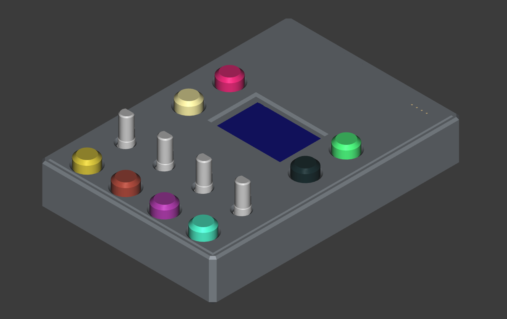
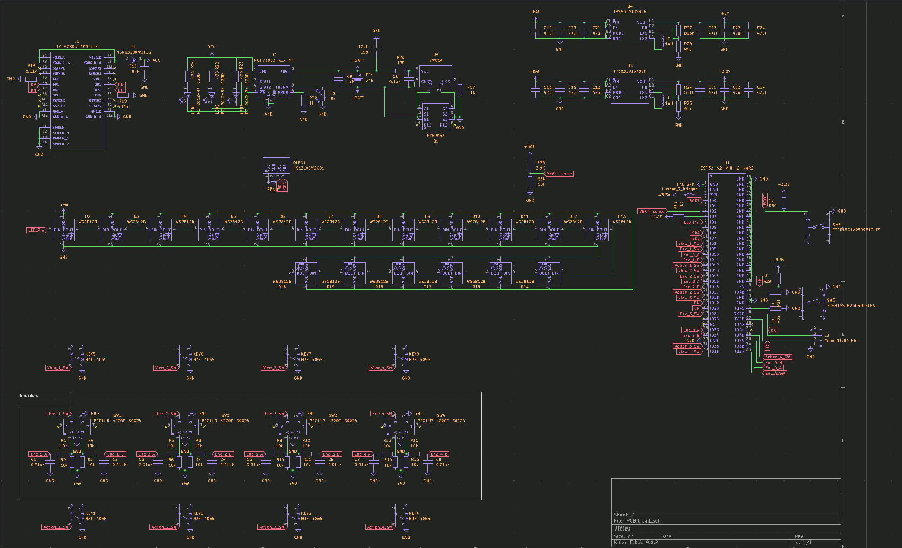
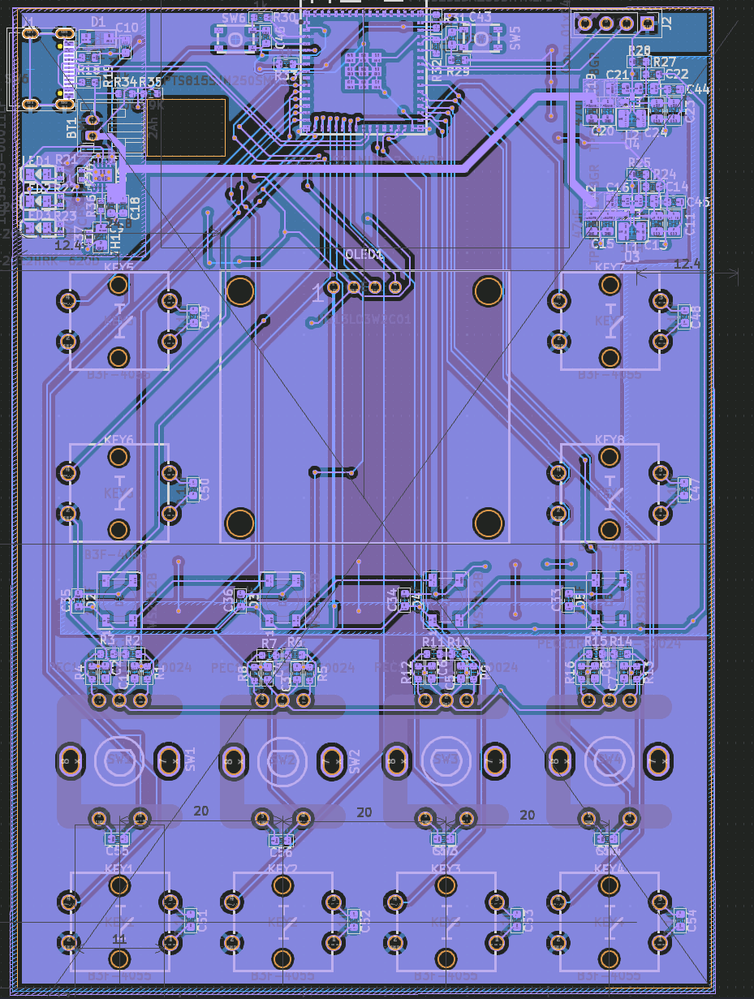
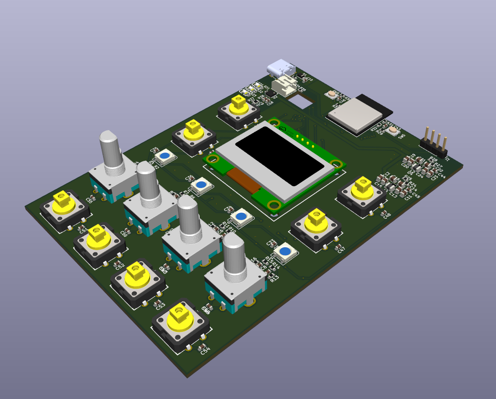

# Home-Assistant-Control-pad

A programmable control pad (buttons and knobs) that integrates with Home Assistant via ESPHome on an ESP32-H2.

## Features

- Controls Home Assistant entities (lights, switches, etc.)
- Over-the-air (OTA) updates

## Images

<details>
  <summary>Case</summary>



</details>
<details>
  <summary>Schematic</summary>
  


</details>
<details>
  <summary>PCB</summary>




</details>

## BOM

| Index | Part Number                               | What the item is for in your project             | Description                          | Pack Quantity | ID                                                                                      | Unit Price | Total Price | Total   |
| ----- | ----------------------------------------- | ------------------------------------------------ | ------------------------------------ | ------------- | --------------------------------------------------------------------------------------- | ---------- | ----------- | ------- |
| 1     | PMEG10010ELRX                             | Reverse polarity protection                      | DIODE SCHOTTKY 100V 1A SOD123W       | 2             | 1727+AC0-2394+AC0-1+AC0-ND                                                              | $0.27      | $0.54       | $133.08 |
| 2     | DFE252012P+AC0-1R0M+AD0-P2                | Inductor for buck+AC0-boost                      | FIXED IND 1UH 3.2A 0.042OHM SMD      | 3             | 490+AC0-10647+AC0-1+AC0-ND                                                              | $0.22      | $0.66       |
| 3     | LS R976+AC0-NR+AC0-1+AC0-0+AC0-20+AC0-R18 | Led indication                                   | LED RED DIFFUSED 0805 SMD            | 3             | 475+AC0-LSR976+AC0-NR+AC0-1CT+AC0-ND                                                    | $0.15      | $0.45       |
| 4     | LG R971+AC0-KN+AC0-1+AC0-0+AC0-20+AC0-R18 | Led indication                                   | LED GREEN DIFFUSED 0805 SMD          | 3             | 475+AC0-LGR971+AC0-KN+AC0-1CT+AC0-ND                                                    | $0.15      | $0.45       |
| 5     | LTST+AC0-C170KSKT                         | Led indication                                   | LED YELLOW CLEAR SMD                 | 3             | 160+AC0-1416+AC0-1+AC0-ND                                                               | $0.17      | $0.51       |
| 6     | RMCF0603JT10K0                            | Passive                                          | RES 10K OHM 5% 1/10W 0603            | 22            | RMCF0603JT10K0CT+AC0-ND                                                                 | $0.02      | $0.42       |
| 7     | CRCW06035K11FKEAC                         | Passive                                          | RES 5.11K OHM 1% 1/10W 0603          | 3             | 541+AC0-5491+AC0-1+AC0-ND                                                               | $0.10      | $0.30       |
| 8     | RC0402FR+AC0-071KL                        | Passive                                          | RES 1K OHM 1% 1/16W 0402             | 2             | 311+AC0-1.00KLRCT+AC0-ND                                                                | $0.10      | $0.20       |
| 9     | RC0402FR+AC0-07470RL                      | Passive                                          | RES 470 OHM 1% 1/16W 0402            | 4             | 311+AC0-470LRCT+AC0-ND                                                                  | $0.10      | $0.40       |
| 10    | RC0603FR+AC0-07511KL                      | Passive                                          | RES 511K OHM 1% 1/10W 0603           | 2             | 311+AC0-511KHRCT+AC0-ND                                                                 | $0.10      | $0.20       |
| 11    | RC0603FR+AC0-0791KL                       | Passive                                          | RES 91K OHM 1% 1/10W 0603            | 3             | 311+AC0-91.0KHRCT+AC0-ND                                                                | $0.10      | $0.30       |
| 12    | RC0603FR+AC0-07806KL                      | Passive                                          | RES 806K OHM 1% 1/10W 0603           | 2             | 311+AC0-806KHRCT+AC0-ND                                                                 | $0.10      | $0.20       |
| 13    | RC0603FR+AC0-071KL                        | Passive                                          | RES 1K OHM 1% 1/10W 0603             | 13            | 311+AC0-1.00KHRCT+AC0-ND                                                                | $0.01      | $0.12       |
| 14    | RC0603FR+AC0-073K9L                       | Passive                                          | RES 3.9K OHM 1% 1/10W 0603           | 2             | 311+AC0-3.90KHRCT+AC0-ND                                                                | $0.10      | $0.20       |
| 15    | RC0402FR+AC0-071K54L                      | Passive                                          | RES 1.54K OHM 1% 1/16W 0402          | 2             | YAG3040CT+AC0-ND                                                                        | $0.10      | $0.20       |
| 16    | RC0402FR+AC0-0769K8L                      | Passive                                          | RES 69.8K OHM 1% 1/16W 0402          | 2             | YAG3216CT+AC0-ND                                                                        | $0.10      | $0.20       |
| 17    | PEC11R+AC0-4220F+AC0-S0024                | Rotate action                                    | ROTARY ENCODER MECHANICAL 24PPR      | 7             | PEC11R+AC0-4220F+AC0-S0024+AC0-ND                                                       | $1.89      | $13.23      |
| 18    | PTS815SJG250SMTR LFS                      | Esp32 buttons                                    | SWITCH TACTILE SPST+AC0-NO 0.05A 12V | 3             | CKN12217+AC0-1+AC0-ND                                                                   | $0.28      | $0.84       |
| 19    | TX08F103F3435ER                           | NTC Thermistor                                   | THERMISTOR 0805 10K/3435             | 2             | 273+AC0-TX08F103F3435ERCT+AC0-ND                                                        | $0.12      | $0.24       |
| 20    | ESP32+AC0-S2+AC0-MINI+AC0-2+AC0-N4R2      | MCU                                              | RF TXRX MOD WIFI PCB TRACE SMD       | 2             | 1965+AC0-ESP32+AC0-S2+AC0-MINI+AC0-2+AC0-N4R2CT+AC0-ND                                  | $4.31      | $8.62       |
| 21    | MCP73833T+AC0-FCI/MF                      | Battery charger                                  | IC BATT CONTRL LI+AC0-ION 1CEL 10DFN | 2             | MCP73833T+AC0-FCI/MFCT+AC0-ND                                                           | $1.14      | $2.28       |
| 22    | TPS631010YBGR                             | Buck+AC0-Boost                                   | IC REG BUCK BST ADJ 1.5A 8DSBGA      | 3             | 296+AC0-TPS631010YBGRCT+AC0-ND                                                          | $1.29      | $3.87       |
| 23    | C0603C103J5REC7411                        | Passive                                          | CAP CER SMD 0603 .01UF 5% X7R 50     | 13            | 399+AC0-17568+AC0-1+AC0-ND                                                              | $0.10      | $1.33       |
| 24    | C0603C104J5REC7411                        | Passive                                          | CAP CER 0603                         | 20            | 399+AC0-C0603C104J5REC7411CT+AC0-ND                                                     | $0.11      | $2.24       |
| 25    | CL10A105KQ8NNNC                           | Passive                                          | CAP CER 1UF 6.3V X5R 0603            | 2             | 1276+AC0-1036+AC0-1+AC0-ND                                                              | $0.10      | $0.20       |
| 26    | CL10A106KQ8NNNC                           | Passive                                          | CAP CER 10UF 6.3V X5R 0603           | 13            | 1276+AC0-1038+AC0-1+AC0-ND                                                              | $0.03      | $0.39       |
| 27    | CL21A476MQYNNNG                           | Passive                                          | CAP CER 47UF 6.3V X5R 0805           | 15            | 1276+AC0-6467+AC0-1+AC0-ND                                                              | $0.16      | $2.37       |
| 28    | 16347                                     | Led indication                                   | ADDRESS LED RED/GRN/BLUE             | 5             | 1568+AC0-16347CT+AC0-ND                                                                 | $0.68      | $3.40       |
| 29    | B3F+AC0-4055                              | Push Action                                      | SWITCH TACTILE SPST+AC0-NO 0.05A 24V | 10            | SW414+AC0-ND                                                                            | $0.42      | $4.23       |
| 30    | S2B+AC0-PH+AC0-K+AC0-S                    | Battery connector                                | CONN HEADER R/A 2POS 2MM             | 2             | 455+AC0-1719+AC0-ND                                                                     | $0.11      | $0.22       |
| 31    | PCB                                       | PCB                                              |                                      | 1             | https://aisler.net                                                                      | $42.57     | $42.57      |
| 32    | Battery                                   | Power Source                                     | 103450 1800mAh                       | 1             | https://www.ebay.es/itm/255510046348                                                    | $15.44     | $15.44      |
| 33    | Display                                   | Displays The UI                                  | I2C display                          | 1             | https://es.aliexpress.com/item/1005006862867338.html                                    | $2.62      | $2.62       |
| 34    | Rubber Feet                               | Adds friction to the base so it doesn+IBk-t slip |                                      | 1             | https://es.aliexpress.com/item/1005005275590870.html                                    | $3.11      | $3.11       |
| 35    | ELEGOO PLA filament                       | Printing case                                    |                                      | 1             | https://www.amazon.es/-/en/Filament-Printer-Dimensional-Accuracy-Printers/dp/B0CD77VHBZ | $20.53     | $20.53      |

## Configuration

Remember to set your secrets in [secrets.yaml](Code/secrets.example.yaml).

All firmware configuration lives in [code.yaml](Code/code.yaml):
PS: This configuration is for reference only, The final configuration will be for the ESP32-S2. You'll also have to configure the devices you want to control in Home Assistant.
```yaml
esphome:
  name: controlpad
  friendly_name: ControlPad

esp32:
  board: esp32-c3-devkitm-1
  framework:
    type: arduino

# Enable logging
logger:

# Enable Home Assistant API
api:
  encryption:
    key: !secret api_key

ota:
  - platform: esphome
    password: !secret ota_password

wifi:
  ssid: !secret wifi_ssid
  password: !secret wifi_password

  # Enable fallback hotspot (captive portal) in case wifi connection fails
  ap:
    ssid: "Controlpad Fallback Hotspot"
    password: "wHjqyQOLnaPa"

globals:
  - id: page_active
    type: int
    initial_value: "0"

i2c:
  sda: GPIO6
  scl: GPIO7
  frequency: 800kHz
  scan: true

binary_sensor:
  - platform: gpio
    pin:
      number: GPIO2
      mode: INPUT_PULLUP
      inverted: true
    name: "Button1"
    on_press:
      - display.page.show: page1
      - lambda: |-
          id(page_active) = 1;

  - platform: gpio
    pin:
      number: GPIO4
      mode: INPUT_PULLUP
      inverted: true
    name: "Button2"
    on_press:
      - display.page.show: page2
      - lambda: |-
          id(page_active) = 2;

  - platform: gpio
    pin:
      number: GPIO21
      mode: INPUT_PULLUP
      inverted: true
    name: "toggle1"
    on_press:
      then:
        - if:
            condition:
              lambda: |-
                return id(page_active) == 1;
            then:
              - homeassistant.service:
                  service: light.toggle
                  data:
                    entity_id: light.led_controller_1_light_bar

sensor:
  - platform: homeassistant
    name: "Bar Light Brightness"
    id: led_controller_1_light_bar_brightness
    entity_id: light.led_controller_1_light_bar
    attribute: brightness
    unit_of_measurement: "%"
    filters:
      - lambda: |-
          if (isnan(x)) return 0.0f;
          return int(x * 100.0f / 255.0f);

  - platform: adc
    pin: GPIO3
    name: "potentiometer1"
    id: potentiometer1
    attenuation: 12db # allow 0–3.3 V range
    update_interval: 20ms
    unit_of_measurement: "%"
    filters:
      - sliding_window_moving_average:
          window_size: 10
          send_every: 5
      - lambda: |-
          if (isnan(x)) return 0.0f;
          int pot_val = int(x * 100.0f / 2.9f);
          if (pot_val > 100) pot_val = 100;
          return pot_val;
      - delta: 1.0

    on_value:
      then:
        - if:
            condition:
              lambda: |-
                return id(page_active) == 1;
            then:
              - homeassistant.service:
                  service: light.turn_on
                  data:
                    entity_id: light.led_controller_1_light_bar
                    brightness_pct: !lambda "return (int)x;"

# SH1106 128×64 over I2C
display:
  - platform: ssd1306_i2c
    model: SH1106 128x64
    id: display1
    address: 0x3C
    rotation: 0
    update_interval: 100ms
    pages:
      - id: page1
        lambda: |-
          int val1 = int((id(led_controller_1_light_bar_brightness).state / 100.0f) * 31);
          if (val1 != 0) {
            val1 += 1;
          }
          it.filled_rectangle(10, 64-val1, 5, 33);

          // it.printf(0, 0, id(font1), "%.0f%%", id(led_controller_1_light_bar_brightness).state);
      - id: page2
        lambda: |-
          it.print(0, 10, id(font1), "This is page 2!");
          it.filled_rectangle(10, 20, 80, 5);

font:
  - file: "gfonts://Ubuntu"
    id: font1
    size: 20

captive_portal:
```
